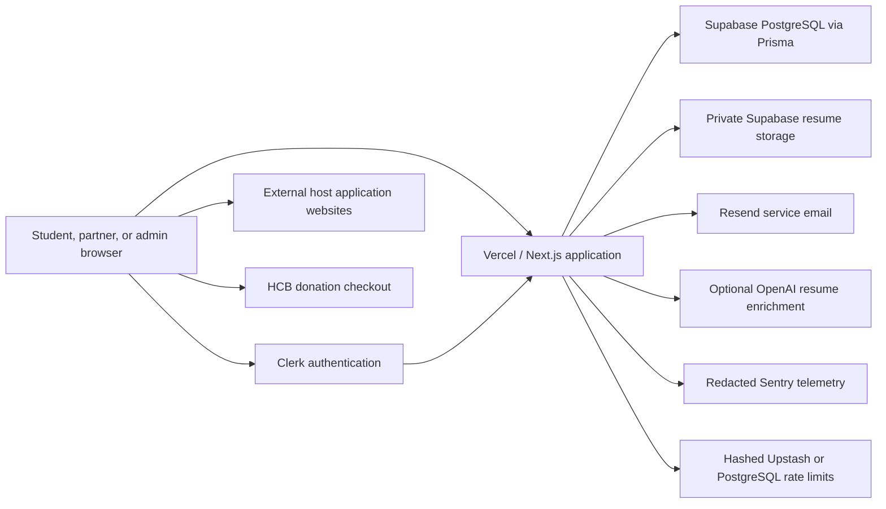

# Data-flow overview

> **Draft for review — not legal advice and not attorney approved.**

- Browser-to-application and provider traffic uses HTTPS.
- Authorization is enforced server-side using the Clerk user and database role,
  student-profile ownership, or partner-organization membership.
- Resume objects use owner-scoped private paths and signed download URLs.
- Public opportunity records exclude private student records and internal notes.
- External application and donation submissions leave FP and are governed by the
  destination provider.
- Optional AI enrichment is not required for deterministic resume extraction.
- Logs should contain operational identifiers and counts, not document contents,
  contact information, tokens, cookies, authorization headers, or signed URLs.

Open review: provider regions, retention, legal bases, cross-border transfers,
and contract/DPA status require owner and counsel confirmation.
